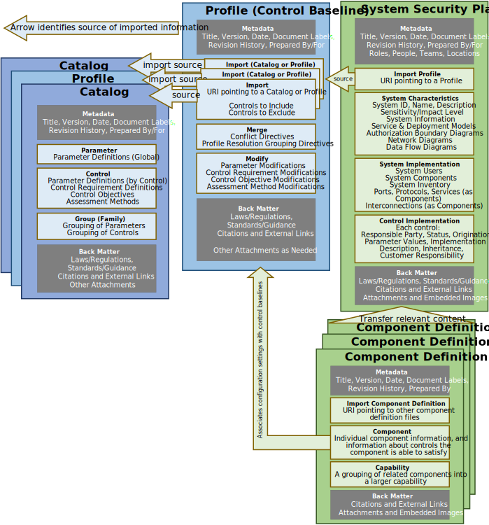

| Component Schema | Component Converters 
|:--- |:--- |
| [XML Schema](https://raw.githubusercontent.com/usnistgov/OSCAL/master/xml/schema/oscal_component_schema.xsd) | [JSON to XML Converter](https://raw.githubusercontent.com/usnistgov/OSCAL/master/xml/convert/oscal_component_json-to-xml-converter.xsl) ([How do I use this?](https://github.com/usnistgov/OSCAL/tree/master/xml#converting-oscal-json-content-to-xml)) |
| [JSON Schema](https://raw.githubusercontent.com/usnistgov/OSCAL/master/json/schema/oscal_component_schema.json) | [XML to JSON Converter](https://raw.githubusercontent.com/usnistgov/OSCAL/master/json/convert/oscal_component_xml-to-json-converter.xsl) ([How do I use this?](https://github.com/usnistgov/OSCAL/tree/master/json#converting-oscal-xml-content-to-json)) |

## Purpose

The OSCAL component definition model represents a description of the [controls](../../../concepts/#control) that are supported in a given implementation of a hardware, software, service, policy, process, procedure, or compliance artifact (e.g., FIPS 140-2 validation). The component definition model is part of the OSCAL [implementation](../) layer.

The component definition model allows grouping related components into capabilities, and documenting how the combination of components in a capability together can satisfy specific controls that are not fully satisfied by a single component on its own.

These component definitions can be used by organizations implementing the thing defined by a given component to provide a significant amount of implementation details needed when documenting a system's control implementation in a system security plan. This information can be used by the system security plan author as a starting point for their work, saving time and cost.

## Authors and Consumers

### Component Definition Authors

Product and Service Vendors, Capability Owners, Policy and Process Owners, Standards Bodies, Validation Bodies

Component definitions are authored by vendors of products or services. The vendor can describe the product or service and align implementation settings with control baseline satisfaction.

Capability owners are similar to vendors, except they are typically "in-house". An organization may establish a capability for use by many of the organization's systems and publish a component definition document about the capability.

Policy process owners can publish component definition documents to document which controls are satisfied by the policy or process.

A standards body can publish a component definition document to indicate which controls are satisfied by the adoption of their standard.

Configuration checklist/guide authors can publish a component definition document to describe which controls are enabled by the configuration settings in their checklist.

Validation bodies, such as NIST Labs for FIPS 140-2 validation or Underwriters Laboratories for validation of electrical products, can publish a component definition about the validation they performed on a product.

### Component Definition Consumers

System Owners and System Security Plan Authors

As system owners identify components for use in their system, they consume component definition files by importing the relevant content into their system security plan.

## Model Overview

{}
{}
{}
An OSCAL profile is organized as follows:
- **Metadata**: Metadata syntax is identical and required in all OSCAL models. It includes information such as the document's title, publication version, publication date, and OSCAL version. Metadata is also used to define roles, parties (people, teams and organizations), and locations.
- **Import**: Identifies a component definition from another resource, from which related information is referenced.
- **Component**: Provides information about a defined component that can be part of an implemented system.
- **Capability**: Identifies a capability as a grouping of multiple components or capabilities. 
- **Back Matter**: Back matter syntax is identical in all OSCAL models. It is used for attachments, citations, and embedded content such as graphics. 
{}
{}

{}
{}
{}

## Key Concepts

The OSCAL component definition model represents a description of the controls that are supported in a given implementation of a hardware, software, service, policy, process, or procedure.

Each defined component describes where appropriate:

- Information about the organization that provides, develops, and manages the thing described by the component;
- Characteristics of the component, such as its name, version, model, last-modified date, etc.;
- Details about the controls that could be satisfied by the component;
- Configuration options for achieving specific security or privacy objectives; and
- Assessment tests or scripts that may be used to validate the component's implementation.

The component definition model allows grouping related components into capabilities, and documenting how the combination of components in a capability together can satisfy specific controls that are not fully satisfied by a single component on its own.

A component within a component definition can be used to document and share:

1. proof of compliance for a security requirement for hardware or software, such as FIPS 140-2 validated cryptography,
1. to document information about how a hardware, software, or service offering supports specific security or privacy controls, or
1. demonstrate how a policy or procedure implements a given set of security or privacy controls.

The figure below expresses represents the portion of the OSCAL stack as it relates to an OSCAL Component Definition.



### Modeling Validation Information

OSCAL is designed to allow capture relevant details related to independent validation of components. See [Validation Modeling](../validation-modeling) for details.

